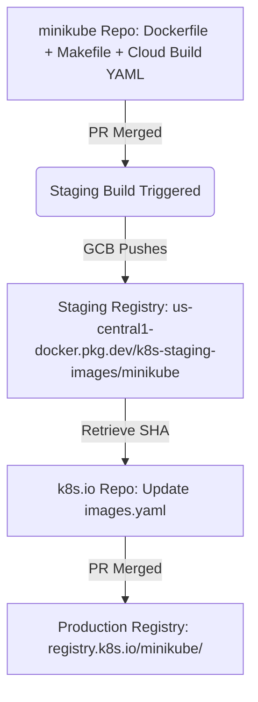

To support various addons and auxiliary features, minikube maintains and utilizes several helper container images:
- **kicbase**: Node image for Docker and Podman drivers
- **storage-provisioner**: Helper image for persistence/dynamic volume provisioning
- **kube-registry-proxy**: NGINX-based proxy for local registries
- **gvisor**: Auxiliary image for gVisor addon support
- **auto-pause-hook**: Webhook for the auto-pause addon
- **kubernetes-bootcamp**: A sample deployment application

This guide explains how to introduce a new container image to this suite or update existing ones, guiding you from the source repository up to the official `registry.k8s.io` promotion pipeline.

---

## Build & Publication Workflow

The publication of images follows a three-step pipeline:
1. **Define target and configuration** in the `kubernetes/minikube` repository.
2. **Configure automatic staging builds** in the `kubernetes/test-infra` repository using Google Cloud Build (GCB).
3. **Promote the built images** to `registry.k8s.io` in the `kubernetes/k8s.io` repository after testing them in staging.



---

## Step 1: Configure minikube Source

Before an image can be compiled by the build pipeline, you must define a multi-architecture push target in the Make configurations and add a Cloud Build configuration.

### 1. Add a Make Target
Images are built for multiple architectures (typically `linux/amd64`, `linux/arm64`, `linux/ppc64le`, `linux/s390x`) using Docker Buildx.
Add a new `.PHONY` build target in `hack/prow/prow_images.mk` that runs `docker buildx build --push`:

```makefile
.PHONY: push-my-new-image-prow
push-my-new-image-prow:
	docker buildx build --push --platform $(PROW_IMAGE_PLATFORMS) \
		-t us-central1-docker.pkg.dev/k8s-staging-images/minikube/my-new-image:$(_GIT_TAG) \
		-t us-central1-docker.pkg.dev/k8s-staging-images/minikube/my-new-image:latest \
		-f deploy/addons/my-new-image/Dockerfile .
```

> [!TIP]
> **Docker Build Context**:
> Use a trailing `.` at the end of `docker buildx build` if your Dockerfile requires repository-level dependencies (like `go.mod` or shared libraries). Otherwise, specify the exact local context directory (e.g., `deploy/images/my-new-image`) to keep build contexts lightweight.

### 2. Add Cloud Build YAML
Under `hack/prow/image/<image-name>/cloudbuild.yaml`, add the Google Cloud Build instructions invoking your Make target:

```yaml
# See https://cloud.google.com/cloud-build/docs/build-config
options:
  substitution_option: ALLOW_LOOSE
steps:
  - name: gcr.io/k8s-staging-test-infra/gcb-docker-gcloud:latest
    env:
      - _GIT_TAG=$_GIT_TAG
      - _PULL_BASE_REF=$_PULL_BASE_REF
    args:
      - make
      - push-my-new-image-prow
substitutions:
  _GIT_TAG: '12345'
  _PULL_BASE_REF: 'master'
```

#### Example minikube Pull Request
See **[minikube PR #23021](https://github.com/kubernetes/minikube/pull/23021)** for a reference implementation adding the `auto-pause-hook` image build target.

---

## Step 2: Register Staging Job in test-infra

Staging jobs are automated Prow jobs managed under `kubernetes/test-infra`. When a PR is merged in `kubernetes/minikube` that affects your image files, Google Cloud Build compiles and pushes the staging image automatically.

1. Submit a Pull Request to **[kubernetes/test-infra](https://github.com/kubernetes/test-infra)**.
2. Modify `config/jobs/kubernetes/minikube/k8s-staging-minikube.yaml` to add your postsubmit staging job.

> [!IMPORTANT]
> **Optimize Triggers with `run_if_changed`**:
> Always specify an accurate `run_if_changed` regex pattern in the Prow job. This guarantees the image build is only run when relevant source files change, saving precious CI resources.
> For example:
> ```yaml
> run_if_changed: "^hack/prow/image/auto-pause-hook/|^deploy/addons/auto-pause/"
> ```

#### Example test-infra Pull Request
See **[test-infra PR #37082](https://github.com/kubernetes/test-infra/pull/37082)** where the staging job is configured for the `auto-pause-hook` addon image.

---

## Step 3: Promote Staging Image to Production

Images inside the staging registry `us-central1-docker.pkg.dev/k8s-staging-images/minikube/` cannot be used directly in release builds. They must be officially promoted to the production registry.

1. Retrieve the exact `sha256` registry digest of your successfully built staging image (visible in the Cloud Build logs or GCR/AR interface).
2. Submit a Pull Request to the **[kubernetes/k8s.io](https://github.com/kubernetes/k8s.io)** repository.
3. Update the image promotion definition located in:
   **[`registry.k8s.io/images/k8s-staging-minikube/images.yaml`](https://github.com/kubernetes/k8s.io/blob/main/registry.k8s.io/images/k8s-staging-minikube/images.yaml)**

Add the new SHA digest and mapping tags under the corresponding image block:

```yaml
- name: my-new-image
  dmap:
    "sha256:57f19c6a0b6a78f180f0ed65b7d548602839f2a5379f1febf3bd7055e729f629": ["v1.0.0", "latest"]
```

Once this PR merges, the Kubernetes Image Promoter automatically promotes your image to `registry.k8s.io/minikube/my-new-image`.
