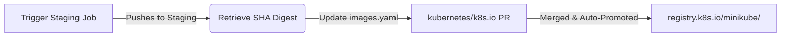

This guide covers how to promote a minikube helper or addon container image from the staging registry (`us-central1-docker.pkg.dev/k8s-staging-images/minikube/`) to the production Kubernetes registry (`registry.k8s.io/minikube/`).

Before promoting, ensure that the image has been defined and its build pipeline has been set up as described in the [Publishing Container Images to registry.k8s.io]() guide.

---

## The Promotion Process

Image promotion is the final step in the release pipeline:



### 1. Trigger the Staging Build
Once the staging job has been registered in `kubernetes/test-infra` once, it will not trigger automatically unless a change occurs in the paths defined in its `run_if_changed` pattern.

To trigger a new staging build for a release:
* Make your code modifications or simply "touch" a tracked file inside the image's source directory.
  
  > [!TIP]
  > **Example (storage-provisioner)**: If you need to trigger a release build of the `storage-provisioner` image without making functional code changes, you can add a dummy comment with a timestamp directly into its Dockerfile at `deploy/storage-provisioner/Dockerfile` (e.g., `# Trigger rebuild: 2026-05-22`). Since the `Dockerfile` is in the path monitored by the job's `run_if_changed` pattern, merging this change will launch the GCB postsubmit build.

* Merge the PR to the `master` branch. This triggers the Prow postsubmit GCB job.

### 2. Grab the SHA Digest
Once the postsubmit build successfully finishes:
1. Navigate to the Prow postsubmit build status dashboard. You can monitor job logs and status on the **[minikube-images Testgrid Dashboard](https://testgrid.k8s.io/minikube-images)**.
2. Look at the build logs or image metadata.
3. Copy the exact **SHA-256 image digest** (e.g., `sha256:57f19c6a0b6a78f180f0ed65b7d548602839f2a5379f1febf3bd7055e729f629`).

### 3. Create a Promotion PR
To officially promote the staging image to production:
1. Fork and clone the **[kubernetes/k8s.io](https://github.com/kubernetes/k8s.io)** repository.
2. Open the file **[`registry.k8s.io/images/k8s-staging-minikube/images.yaml`](https://github.com/kubernetes/k8s.io/blob/main/registry.k8s.io/images/k8s-staging-minikube/images.yaml)**.
3. Add your image's SHA-256 digest mapped to the desired tags:

```yaml
- name: <image-name>
  dmap:
    "sha256:<sha256-digest-from-staging>": ["<version-tag>", "latest"]
```

*For example:*
```yaml
- name: auto-pause-hook
  dmap:
    "sha256:57f19c6a0b6a78f180f0ed65b7d548602839f2a5379f1febf3bd7055e729f629": ["v0.0.1", "latest"]
```

4. Submit a Pull Request with your changes. Once merged, the Kubernetes Image Promoter will automatically copy the image from the staging registry to the public production registry `registry.k8s.io/minikube/`.
