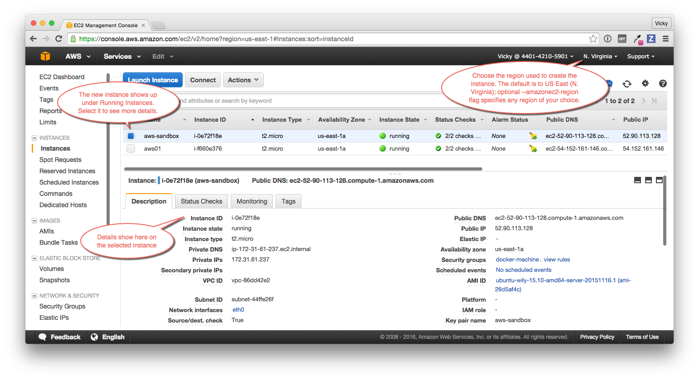

<!--[metadata]>
+++
title = "Provision AWS EC2 Instances"
description = "Using Docker Machine to provision hosts on AWS"
keywords = ["docker, machine, cloud, aws"]
[menu.main]
parent="cloud_examples"
weight=2
+++
<![end-metadata]-->

# Amazon Web Services (AWS) EC2 example

Follow along with this example to create a Dockerized <a href="https://aws.amazon.com/" target="_blank"> Amazon Web Services (AWS)</a> EC2 instance.

### Step 1. Sign up for AWS and configure credentials

1. If you are not already an AWS user, sign up for <a href="https://aws.amazon.com/" target="_blank"> AWS</a> to create an account and get root access to EC2 cloud computers.

    If you have an Amazon account, you can use it as your root user account.

2. Create an IAM (Identity and Access Management) administrator user, an admin group, and a key pair associated with a region.

    From the AWS menus, select **Services** > **IAM** to get started.

    To create machines on AWS, you must supply two parameters:

    * an AWS Access Key ID

    * an AWS Secret Access Key

    See the AWS documentation on <a href="http://docs.aws.amazon.com/AWSEC2/latest/UserGuide/get-set-up-for-amazon-ec2.html" target="_blank">Setting Up with Amazon EC2</a>. Follow the steps for "Create an IAM User" and "Create a Key Pair".

### Step 2. Use Machine to create the instance

1. Optionally, create an AWS credential file.

    You can create an `~/.aws/credentials` file to hold your AWS keys so that you don't have to type them every time you run the `docker-machine create` command. Here is an example of a credentials file.

            [default]
            aws_access_key_id = AKID1234567890
            aws_secret_access_key = MY-SECRET-KEY

2. Run `docker-machine create` with the `amazonec2` driver, your keys, and a name for the new instance.

    **Using a credentials file**

    If you specified your keys in a credentials file, this command looks like this to create an instance called `aws-sandbox`:

            docker-machine create --driver amazonec2 aws-sandbox

    **Specifying keys at the command line**

    If you don't have a credentials file, you can use the flags `--amazonec2-access-key` and `--amazonec2-secret-key` on the command line:

            $ docker-machine create --driver amazonec2 --amazonec2-access-key AKI******* --amazonec2-secret-key 8T93C*******  aws-sandbox

    **Specifying a region**

    By default, the driver creates new instances in region us-east-1 (North Virginia). You can specify a different region by using the `--amazonec2-region` flag. For example, this command creates a machine called "aws-01" in us-west-1 (Northern California).

            $ docker-machine create --driver amazonec2 --amazonec2-region us-west-1 aws-01

3. Go to the AWS EC2 Dashboard to view the new instance.

    Log into AWS with your IAM credentials, and navigate to your EC2 Running Instances.

    

    **Note**: Make sure you set the region appropriately from the menu in the upper right; otherwise, you won't see the new instance. If you did not specify a region as part of `docker-machine create` (with the optional `--amazonec2-region` flag), then the region will be US East, which is the default.

3. At the command terminal, run `docker-machine ls`.

        $ docker-machine ls
        NAME             ACTIVE   DRIVER         STATE     URL                         SWARM   DOCKER        ERRORS      
        aws-sandbox      *        amazonec2      Running   tcp://52.90.113.128:2376            v1.10.0       
        default          -        virtualbox     Running   tcp://192.168.99.100:2376           v1.10.0-rc4   
        aws-sandbox   -        digitalocean   Running   tcp://104.131.43.236:2376           v1.9.1        

    The new `aws-sandbox` instance is running, and it is the active host as indicated by the asterisk (*). When you create a new machine, your command shell automatically connects to it. If for some reason your new machine is not the active host, you'll need to run `docker-machine env aws-sandbox`, followed by `eval $(docker-machine env aws-sandbox)` to connect to it.

### Step 3. Run Docker commands on the instance

1. Run some `docker-machine` commands to inspect the remote host. For example, `docker-machine ip <machine>` gets the host IP address and `docker-machine inspect <machine>` lists all the details.

          $ docker-machine ip
          192.168.99.100

          $ docker-machine inspect aws-sandbox
          {
              "ConfigVersion": 3,
              "Driver": {
                  "IPAddress": "52.90.113.128",
                  "MachineName": "aws-sandbox",
                  "SSHUser": "ubuntu",
                  "SSHPort": 22,
                  ...

2. Verify Docker Engine is installed correctly by running `docker` commands.

    Start with something basic like `docker run hello-world`, or for a more interesting test, run a Dockerized webserver on your new remote machine.

    In this example, the `-p` option is used to expose port 80 from the `nginx` container and make it accessible on port `8000` of the `aws-sandbox` host.

        $ docker run -d -p 8000:80 --name webserver kitematic/hello-world-nginx
        Unable to find image 'kitematic/hello-world-nginx:latest' locally
        latest: Pulling from kitematic/hello-world-nginx
        a285d7f063ea: Pull complete
        2d7baf27389b: Pull complete
        ...
        Digest: sha256:ec0ca6dcb034916784c988b4f2432716e2e92b995ac606e080c7a54b52b87066
        Status: Downloaded newer image for kitematic/hello-world-nginx:latest
        942dfb4a0eaae75bf26c9785ade4ff47ceb2ec2a152be82b9d7960e8b5777e65

    In a web browser, go to `http://<host_ip>:8000` to bring up the webserver home page. You got the `<host_ip>` from the output of the `docker-machine ip <machine>` command you ran in a previous step. Use the port you exposed in the `docker run` command.

    

### Step 4. Use Machine to remove the instance

To remove an instance and all of its containers and images, first stop the machine, then use `docker-machine rm`:

      $ docker-machine stop aws-sandbox
      $ docker-machine rm aws-sandbox
      Do you really want to remove "aws-sandbox"? (y/n): y
      Successfully removed aws-sandbox
## Where to go next

-   [Understand Machine concepts](../concepts.md)
-   [Docker Machine driver reference](../drivers/index.md)
-   [Docker Machine subcommand reference](../reference/index.md)
-   [Provision a Docker Swarm cluster with Docker Machine](https://docs.docker.com/swarm/provision-with-machine/)
