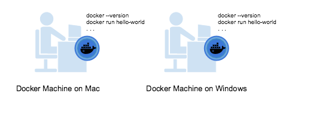
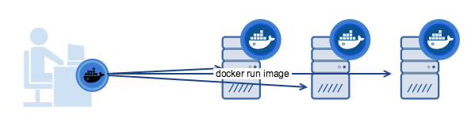
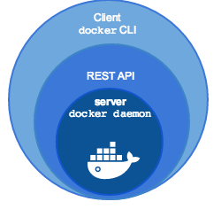
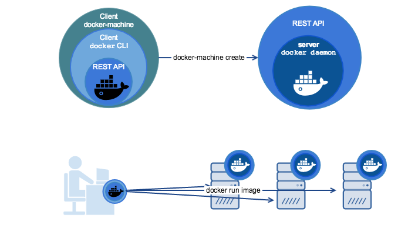

<!--[metadata]>
+++
title = "Machine Overview"
description = "Introduction and Overview of Machine"
keywords = ["docker, machine, amazonec2, azure, digitalocean, google, openstack, rackspace, softlayer, virtualbox, vmwarefusion, vmwarevcloudair, vmwarevsphere, exoscale"]
[menu.main]
parent="workw_machine"
weight=-90
+++
<![end-metadata]-->

# Docker Machine Overview

You can use Docker Machine to:

* Install and run Docker on Mac or Windows
* Provision and manage multiple remote Docker hosts
* Provision Swarm clusters

## What is Docker Machine?
Docker Machine is a tool that lets you install Docker Engine on virtual hosts, and manage the hosts with `docker-machine` commands. You can use Machine to create Docker hosts on your local Mac or Windows box, on your company network, in your data center, or on cloud providers like AWS or Digital Ocean.

Using `docker-machine` commands, you can start, inspect, stop, and restart a managed host, upgrade the Docker client and daemon, and configure a Docker client to talk to your host.

Point the Machine CLI at a running, managed host, and you can run `docker` commands directly on that host. For example, run `docker-machine env default` to point to a host called `default`, follow on-screen instructions to complete `env` setup, and run `docker ps`, `docker run hello-world`, and so forth.

## Why should I use it?

Machine is currently the only way to run Docker on Mac or Windows, and the best way to provision multiple remote Docker hosts on various flavors of Linux.

Docker Machine has these two broad use cases.

* **I want to run Docker on Mac or Windows**

  

  If you work primarily on a Mac or Windows laptop or desktop, you need Docker Machine in order to "run Docker" (that is, Docker Engine) locally. Installing Docker Machine on a Mac or Windows box provisions a local virtual machine with Docker Engine, gives you the ability to connect it, and run `docker` commands.

*  **I want to provision Docker hosts on remote systems**

  

  Docker Engine runs natively on Linux systems. If you have a Linux box as your primary system, and want to run `docker` commands, all you need to do is download and install Docker Engine. However, if you want an efficient way to provision multiple Docker hosts on a network, in the cloud or even locally, you need Docker Machine.

  Whether your primary system is Mac, Windows, or Linux, you can install Docker Machine on it and use `docker-machine` commands to provision and manage large numbers of Docker hosts. It automatically creates hosts, installs Docker Engine on them, then configures the `docker` clients. Each managed host ("**_machine_**") is the combination of a Docker host and a configured client.

## What's the difference between Docker Engine and Docker Machine?

When people say "Docker" they typically mean **Docker Engine**, the client-server application made up of the Docker daemon, a REST API that specifies interfaces for interacting with the daemon, and a command line interface (CLI) client that talks to the daemon (through the REST API wrapper). Docker Engine accepts `docker` commands from the CLI, such as `docker run <image>`, `docker ps` to list running containers, `docker images` to list images, and so on.

**Docker Machine** is a tool for provisioning and managing your Dockerized hosts (hosts with Docker Engine on them). Typically, you install Docker Machine on your local system. Docker Machine has its own command line client `docker-machine` and the Docker Engine client, `docker`. You can use Machine to install Docker Engine on one or more virtual systems. These virtual systems can be local (as when you use Machine to install and run Docker Engine in VirtualBox on Mac or Windows) or remote (as when you use Machine to provision Dockerized hosts on cloud providers). The Dockerized hosts themselves can be thought of, and are sometimes referred to as, managed "**_machines_**".

## Where to go next

-   [Install Docker Machine](install-machine.md)
-   Create and run a Docker host on your [local system using VirtualBox](get-started.md)
-   Provision multiple Docker hosts [on your cloud provider](get-started-cloud.md)
-   [Provision a Docker Swarm cluster with Docker Machine](https://docs.docker.com/swarm/provision-with-machine/)
-   [Understand Machine concepts](concepts.md)
-   [Docker Machine driver reference](drivers/index.md)
-   [Docker Machine subcommand reference](reference/index.md)
-   [Migrate from Boot2Docker to Docker Machine](migrate-to-machine.md)
